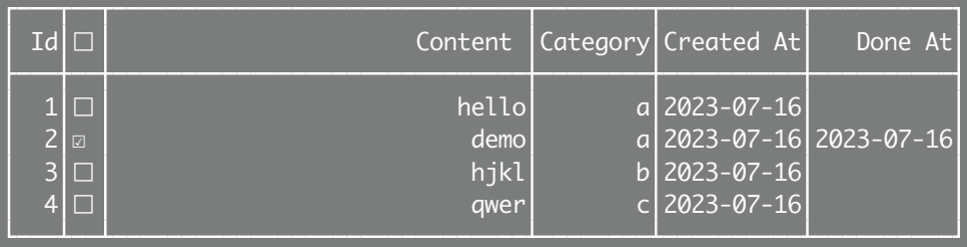

## Go ToDo, GoTo Do

gotodo, a minimalist CLI todo application written by Go




Inspired by [heybran/gtodo](https://github.com/heybran/gtodo), this project is a great practice project for beginners.

## How to use
Clone this project to local, then

```bash
go build main.go
```

Place the generated executable file in a path that has been added to the PATH.

The data file will be automatically generated in `~/.config/gotodo/` when using.

## Usage

    -l, list [category]
        List all todos (in this category)
    -a, add <todo content> [category]
        Add a new todo (in this category)
    -u, update <id>
        Update an existing todo
    -m, markup <id> [undone]
        Mark as done (or undone)
    -d, delete <id>/all
        Delete an/all existing todo
    -h, --help, help
        Show this help message

## License

This application is licensed under the MIT License. See the LICENSE file for details.